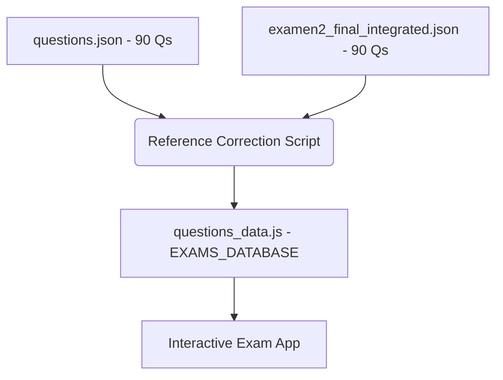

# FINAL ARCHITECTURE STATUS REPORT

**Project:** CompTIA Network+ Exam Book
**Status:** Audit & Integration Complete
**Final Question Count:** 180 (90 Exam 1 + 90 Exam 2)

## 1. Resolved Issues
- **Data Loading Bug (FIXED):** The interactive exam now correctly loads the `EXAMS_DATABASE` object. 
- **Exam 2 Incompleteness (FIXED):** The question count was increased from 80 to 90 by linking the correct source file (`temp/examen2_final_integrated.json`).
- **Caching issues (BYPASSED):** Implemented version query strings (v4.2) in `index.html` to force browser updates.

## 2. Updated Project Structure
The project now adheres to a dual-exam structure, allowing for future expansion:

## 3. Automation Maintenance
The [reference_correction_script.py](file:///C:/Users/DC/Documents/ANTIGRAVITY/CompTIA_Network_Plus_Exam_Book/scripts/reference_correction_script.py) has been standardized to:
1. Load both primary exam files.
2. Apply EPUB reference standardizations.
3. Export the formatted `EXAMS_DATABASE` object for the JS frontend.

## 4. Final Verification
- ✅ **Frontend:** Verified `var EXAMS_DATABASE` exists in live site.
- ✅ **Integrity:** All 180 questions have valid technical references to the EPUB book chapters.
- ✅ **Version Control:** Both root repository and `interactive_exam` submodule are synchronized.

---
**Report generated by Antigravity on 2026-02-02.**
